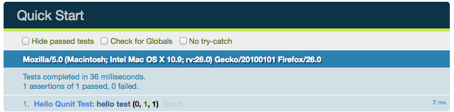
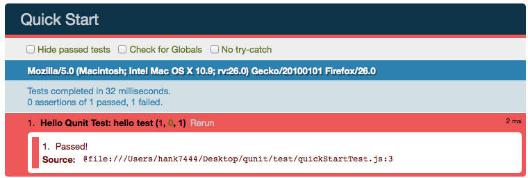
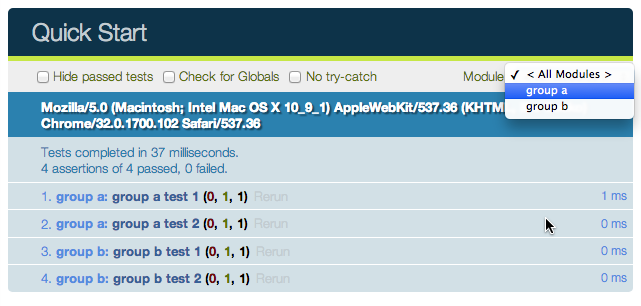
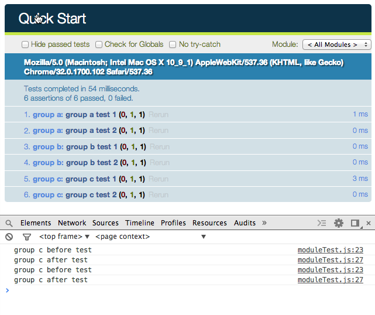

#前端單元測試框架-Qunit教學手冊

## 編輯歷程
<table cellspacing="0" border="1">
   <thead>
     <tr>
	 <th>時間</th>
	 <th>版本</th>
     <th>說明</th>
     <th>編輯人</th>
    </tr>
   </thead>
   
   <tbody>
   
    <tr>
     <td>2014.02.19</td> 
     <td>0.9</td>
     <td>
         * 新增Qunit食譜內容
     </td>
     <td>Hank Kuo</td>
    </tr>
   
     <tr>
     <td>2014.02.18</td> 
     <td>0.9</td>
     <td>
         * 新增3,4章內容
     </td>
     <td>Hank Kuo</td>
    </tr>
   
    <tr>
     <td>2014.02.17</td> 
     <td>0.9</td>
     <td>
         * 建立文件
     </td>
     <td>Hank Kuo</td>
    </tr>
    
   </tbody>
</table>

## 章節
#### [1. QUnit簡介](#intro)

#### [2. QUnit環境配置](#env)

#### [3. QUnit API介紹-Assert](#assert)
* [3.1 deepEqual()](#assert_deepEqual)
* [3.2 propEqual()](#assert_propEqual)
* [3.3 equal()](#assert_equal)
* [3.4 strictEqual()](#assert_strictEqual)
* [3.5 deepEqual, propEqual, equal, strictEqual詳細測試範例](#assert_equalsTest)
* [3.6 ok()](#assert_ok)
* [3.7 throw()](#assert_throw)


#### [4. QUnit API介紹-Test](#test)
* [4.1 test()](#test_test)
* [4.2 asyncTest()](#test_asyncTest)
* [4.3 test()與async()使用時機與異步測試細節建議](#test_asyncDetail)
* [4.4 使用test()作異步測試範例](#test_testExample)
* [4.5 使用asyncTest作異步測試範例](#test_asyncExample)
* [4.6 expect()](#test_expect)
* [4.7 module()](#test_module)

#### [附錄1. Qunit 食譜](#cookbook)
1. [該如何對表單作單元測試?](#cookbook_form)
2. [該如何對css作單元測試?](#cookbook_css)


---

##1. QUnit簡介<a id="intro"></a>

QUnit是一套Javascript的Tesing Framework，他是由jQuery團隊開發用來對jQuery，
jQuery UI 和 jQuery Mobile這些專案的單元測試。

* 官方網站位置：[http://qunitjs.com](http://qunitjs.com/)
* 官方最新套件js位置：[qunit-git.js](http://code.jquery.com/qunit/qunit-git.js)
* 官方最新套件css位置：[qunit-git.css](http://code.jquery.com/qunit/qunit-git.css)


####QUnit的優點：

* 使用起來非常方便，有漂亮的外觀和完整的測試功能（包括異步測試)。
* 非常簡單，容易上手。
* 不需要依賴其它任何軟件包或框架，只要能運行JS的地方就可以，QUnit本身只有一個JS文件和CSS文件，當然如果需要可以和JQuery等其它框架整合。
* 不僅支持在瀏覽器中測試，還支持在Rhino和node.js等後端進行測試。

####QUnit的缺點：

* 對自動測試的支援不好，很難和Ant/Maven或自動構建等工具整合，主要用在瀏覽器中進行測試。

##2. QUnit環境配置<a id="env"></a>

Qunit使用上相當簡單，只有兩個檔案：

* ####Qunit.js
* ####Qunit.css

我們可以將測試的程式碼直接寫在.html檔案中：

```
<!doctype html>
<html lang="en">

<head>
    <meta charset="UTF-8">
    <title>Quick Start</title>
    
    <!-- Qunit css檔案 -->
    <link href="lib/qunit/qunit-1.14.0.css" type="text/css" rel="stylesheet">
    
</head>
    <body>

		<!-- Qunit測試結果會使用到的div -->
        <div id="qunit"></div>
        <div id="qunit-fixture"></div>

		<!-- Qunit js檔案 -->
        <script type="text/javascript" src="lib/qunit/qunit-1.14.0.js"></script>
        
        <!-- 單元測試部分的程式碼 -->
        <script>
            module('Hello Qunit Test');
            test('hello test', function() {
	            ok(1 == '1', 'Passed!');
            });
        </script>
        
    </body>
</html>
```
但是比較建議的做法是，將測試的程式碼獨立寫在一個js檔案裡，這樣可以讓畫面更乾淨並且將實際與測試的程式碼分離：

js/test/quickStartTest.js

```
module('Hello Qunit Test');
test('hello test', function() {
	ok(1 == '1', 'Passed!');
});
```


html/test/quickStart.html

```
<!doctype html>
<html lang="en">

<head>
    <meta charset="UTF-8">
    <title>Quick Start</title>
    
    <!-- Qunit css檔案 -->
    <link href="lib/qunit/qunit-1.14.0.css" type="text/css" rel="stylesheet">
    
</head>
    <body>

		<!-- Qunit測試結果會使用到的div -->
        <div id="qunit"></div>
        <div id="qunit-fixture"></div>

		<!-- Qunit js檔案 -->
        <script type="text/javascript" src="lib/qunit/qunit-1.14.0.js"></script>
        
        <!-- 單元測試部分的程式碼 -->
        <script type="text/javascript" src="test/quickStartTest.js"></script>
      
    </body>
</html>
```
將上述程式碼寫好後並重新整理網頁，會看到下面的畫面，代表單元測試成功囉!



<br>

我們可以故意讓測試不通過試試看：

js/test/quickStartTest.js

```
module('Hello Qunit Test');
test('hello test', function() {
	ok(1 == '5', 'Passed!'); // 故意不通過!
});
```

Opps! 當出錯的時候, Qunit會用紅色邊框警示，並且告知測試不通過的檔案與程式碼行數


<br>

## 3. QUnit API介紹-Assert<a id="assert"></a>

Qunit的斷言(assert)API有下列10個:

* [deepEqual()](#assert_deepEqual)，使用`===`比較符，`可比較基本型別與object, array, regular expression, date, function`
* notDeepEqual()，同deepEqual使用方法,只是變為當`actual !== expected爲測試通過`
* [propEqual()](#assert_propEqual)，使用`===`比較符，跟deepEqual不同，propEqaul可以`比較兩個擁有不同constructor與prototype，但是屬性一樣的物件`。
* notPropEqual()，同propEqual使用方法，只是變為當`actual !== expected為測試通過`
* [equal()](#assert_equal)，使用`==`比較符，`只可比較基本型別`
* notEqual()，同equal使用方法，只是變為當`actual != expected為測試通過`
* [strictEqual()](#assert_strictEqual)，使用`===`比較符，`只可比較基本類型`
* notStrictEqual()，同strictEqual使用方法，只是變為當`actual !== expected為測試通過`
* [ok()](#assert_ok)，只需一個參數，如果參數等於true則測試通過
* [throws()](#assert_throws)，測試拋出自定義錯誤

#### 3.1 deepEqual(actual, expected, message)<a id="assert_deepEqual"></a>
deepEqual()可以像equal()那樣使用，但是他`適用的場景更多`。他不是使用簡單比較符(==)，他使用的是更精確的比較符(===)。這種情況下，undefined不等於null，0或者空字元串(“”)。他同時也`比較對象的內容`，{key: value} 等於 {key: value}。deepEqual()同樣也處理NaN，`dates`，`正則表達式`，`數組`和`函數`，而`equal()只檢查對象實例`。

參數說明:
 
* actual: 要測試的物件或表示式
* expected: 預期測試的結果
* message: 測試說明

#### 3.2 propEqual(actual, expected, message)<a id="assert_propEqual"></a>
propEqual()可以像deepEqual()那樣使用，它使用(===)比較符，跟deepEqual()最大不同的是，propEqual()不會比較兩個物件的prototype與constructor是否為同一個，只要內含的資料與屬性相同即判斷爲測試通過。

參數說明:
 
* actual: 要測試的物件或表示式
* expected: 預期測試的結果
* message: 測試說明

#### 3.3 equal(actual, expected, message)<a id="assert_equal"></a>
equal()使用簡單的比較符(==)來比較期望值和實際值。當他們相等的時候則測試通過。

參數說明:
 
* actual: 要測試的物件或表示式
* expected: 預期測試的結果
* message: 測試說明

#### 3.4 strictEqual(actual, expected, message)<a id="assert_strictEqual"></a>
strictEqual()可以像equal()那樣使用,但它使用(===)來比較期望值和實際值，比equal()嚴格，並且同樣只可比較基本類型。

參數說明:
 
* actual: 要測試的物件或表示式
* expected: 預期測試的結果
* message: 測試說明


#### 3.5 deepEqual, propEqual, equal, strictEqual詳細測試範例<a id="assert_equalsTest"></a>


js/test/equals.js

```
module('Equals Test');


test('boolean test', function() {

	var testBoolean = true;
	deepEqual(testBoolean, true, 'deepEqual test'); // ok
	equal(testBoolean, true, 'equal test'); // ok
	propEqual(testBoolean, true, 'propEqual test'); // ok
	strictEqual(testBoolean, true, 'strictEqual test'); // ok
});


test('boolean test, 布林值true與整數1測試', function() {

	var testBoolean = true;
	deepEqual(testBoolean, 1, 'deepEqual test'); // failed
	equal(testBoolean, 1, 'equal test'); // ok
	propEqual(testBoolean, 1, 'propEqual test'); // ok
	strictEqual(testBoolean, 1, 'strictEqual test'); // failed
});


test('int test', function() {

	var testInt = 1;
	deepEqual(testInt, 1, 'deepEqual test'); // failed
	equal(testInt, 1, 'equal test'); // ok
	propEqual(testInt, 1, 'propEqual test'); // ok
	strictEqual(testInt, 1, 'strictEqual test'); // ok
});


test('int test, 整數1與字串1測試', function() {

	var testInt = 1;
	deepEqual(testInt, '1', 'deepEqual test'); // failed
	equal(testInt, '1', 'equal test'); // ok
	propEqual(testInt, '1', 'propEqual test'); // failed, 貌似propEqual把整數當物件來測, 導致測試不通過
	strictEqual(testInt, '1', 'strictEqual test'); // failed
});


test('float test', function() {

	var testFloat = 10.55;
	deepEqual(testFloat, 10.55, 'deepEqual test'); // ok
	equal(testFloat, 10.55, 'equal test'); // ok
	propEqual(testFloat, 10.55, 'propEqual test'); // ok
	strictEqual(testFloat, 10.55, 'strictEqual test'); // ok
});


test('string test', function() {

	var testString = 'test string';
	deepEqual(testString, 'test string', 'deepEqual test'); // ok
	equal(testString, 'test string', 'equal test'); // ok
	propEqual(testString, 'test string', 'propEqual test'); // ok
	strictEqual(testString, 'test string', 'strictEqual test'); // ok
});


test('array test 一維陣列', function() {

	var testArray = [1, 2, 'hello', 'world'];
	deepEqual(testArray, [1, 2, 'hello', 'world'], 'deepEqual test'); // ok
	equal(testArray, [1, 2, 'hello', 'world'], 'equal test'); // failed, 不支援陣列比較
	propEqual(testArray, [1, 2, 'hello', 'world'], 'propEqual test'); // ok
	strictEqual(testArray, [1, 2, 'hello', 'world'], 'strictEqual test'); // failed, 不支援陣列比較
});


test('array test, 巢狀陣列', function() {

	var testArray = [1, 2, 'hello', 'world', [1, 2, 3]];
	deepEqual(testArray, [1, 2, 'hello', 'world', [1, 2, 3]], 'deepEqual test'); // ok
	equal(testArray, [1, 2, 'hello', 'world', [1, 2, 3]], 'equal test'); // failed, 不支援陣列比較
	propEqual(testArray, [1, 2, 'hello', 'world', [1, 2, 3]], 'propEqual test'); // ok
	strictEqual(testArray, [1, 2, 'hello', 'world', [1, 2, 3]], 'strictEqual test'); // failed, 不支援陣列比較
});


test('array test, 陣列(有兩個記憶體位置不同函式)', function() {

	var testArray = [1, 2, 'hello', 'world', function() { return 1;}];
	deepEqual(testArray, [1, 2, 'hello', 'world', function() { return 1;}], 'deepEqual test'); // failed
	equal(testArray, [1, 2, 'hello', 'world', function() { return 1;}], 'equal test'); // failed, 不支援陣列比較
	propEqual(testArray, [1, 2, 'hello', 'world', function() { return 1;}], 'propEqual test'); // ok
	strictEqual(testArray, [1, 2, 'hello', 'world', function() { return 1;}], 'strictEqual test'); // failed, 不支援陣列比較
});


test('array test, 陣列(有兩個記憶體位置相同的函式)', function() {

	var func = function() { 
		return 1;
	};
	var testArray = [1, 2, 'hello', 'world', func];
	deepEqual(testArray, [1, 2, 'hello', 'world', func], 'deepEqual test'); // ok
	equal(testArray, [1, 2, 'hello', 'world', func], 'equal test'); // failed
	propEqual(testArray, [1, 2, 'hello', 'world', func], 'propEqual test');  // ok
	strictEqual(testArray, [1, 2, 'hello', 'world', func], 'strictEqual test'); // failed
});


test('object test, 兩個內容一樣, 但記憶體位置不一樣的物件(無函式)', function() {

	var testObject = {
		name: 'mark',
		age: 18,
		profile: {
			job: 'IT Geek'
		}
	};
	var expectObject = {
		name: 'mark',
		age: 18,
		profile: {
			job: 'IT Geek'
		}
	};
	deepEqual(testObject, expectObject, 'deepEqual test'); // ok
	equal(testObject, expectObject, 'equal test'); // failed, 不支援物件比較
	propEqual(testObject, expectObject, 'propEqual test'); // ok
	strictEqual(testObject, expectObject, 'strictEqual test'); // failed, 不支援物件比較
});


test('object test, 兩個內容一樣, 但記憶體位置不一樣的物件(有函式)', function() {

	var testObject = {
		name: 'mark',
		getName: function() {
			return this.name;
		}
	};
	var expectObject = {
		name: 'mark',
		getName: function() {
			return this.name;
		}
	};
	deepEqual(testObject, expectObject, 'deepEqual test'); // failed
	equal(testObject, expectObject, 'equal test'); // failed, 不支援物件比較
	propEqual(testObject, expectObject, 'propEqual test'); // ok
	strictEqual(testObject, expectObject, 'strictEqual test'); // failed, 不支援物件比較
});


test('object has function test, 預期結果物件的getName()爲測試物件的getName()的參考', function() {

	var testObject = {
		name: 'mark',
		age: 18,
		profile: {
			job: 'IT Geek'
		},
		getName: function() {
			return this.name;
		}
	};
	var expectObject = {
		name: 'mark',
		age: 18,
		profile: {
			job: 'IT Geek'
		},
		getName: testObject.getName
	};
	deepEqual(testObject, expectObject, 'deepEqual test'); // ok
	equal(testObject, expectObject, 'equal test'); // failed, 不支援物件比較
	propEqual(testObject, expectObject, 'propEqual test'); // ok
	strictEqual(testObject, expectObject, 'strictEqual test'); // failed, 不支援物件比較
});


test('function test, 兩個內容一樣, 但是記憶體位置不一樣的函式', function() {

	var testFunction = function(a, b) {
		return a + b;
	};
	var expectFunction = function(a, b) {
		return a + b;
	};
	deepEqual(testFunction, expectFunction, 'deepEqual test'); // failed
	equal(testFunction, expectFunction, 'equal test'); // failed
	propEqual(testFunction, expectFunction, 'propEqual test'); // ok
	strictEqual(testFunction, expectFunction, 'strictEqual test'); // failed
});


test('function test, 預期結果函式爲測試函式的參考', function() {

	var testFunction = function(a, b) {
		return a + b;
	};
	var expectFunction = testFunction;

	deepEqual(testFunction, expectFunction, 'deepEqual test'); // ok
	equal(testFunction, expectFunction, 'equal test'); // ok, 建議還是用deepEqual來進行函式的比較
	propEqual(testFunction, expectFunction, 'propEqual test'); // ok
	strictEqual(testFunction, expectFunction, 'strictEqual test'); // ok, 建議還是用deepEqual來進行函式的比較
});


test('regular expression test, 正規表示式物件測試', function() {

	var regTest = new RegExp("(([a-zA-Z0-9]+)=([a-zA-Z0-9]+))","ig");
	var regExpect = new RegExp("(([a-zA-Z0-9]+)=([a-zA-Z0-9]+))","ig");

	deepEqual(regTest, regExpect, 'deepEqual test'); // ok
	equal(regTest, regExpect, 'equal test'); // failed, 不支緣正規表示式比較
	propEqual(regTest, regExpect, 'propEqual test'); // ok
	strictEqual(regTest, regExpect, 'strictEqual test'); // failed, 不支緣正規表示式比較
});


test('date test, 日期物件測試', function() {

	var dateTest = new Date(79, 5, 24, 11, 33, 0);
	var dateExpect = new Date(79, 5, 24, 11, 33, 0);

	deepEqual(dateTest, dateExpect, 'deepEqual test'); // ok
	equal(dateTest, dateExpect, 'equal test'); // failed, 不支援日期比較
	propEqual(dateTest, dateExpect, 'propEqual test'); // ok
	strictEqual(dateTest, dateExpect, 'strictEqual test'); // failed, 不支援日期比較
});
```

#### 3.6 ok(state, message)<a id="assert_ok"></a>
ok()是最基本的方法，他只需要一個參數，如果參數等於true則測試通過。例外它還接受額外的字串參數，用於顯示測試結果。

參數說明:
 
* state: 要測試的值
* message: 測試說明

範例:

js/test/ok.js

```
test('ok test', function() {
    ok(true, 'true succeeds');
    ok('non-empty', 'non-empty string succeeds');
    ok(1, 'integer succeeds');
    ok(1.11, 'float succeeds');
    ok({name: 'hank'}, 'object succeeds');
    ok(function() {return 1;}, 'function succeeds');

    ok(false, 'false fails');
    ok(0, '0 fails');
    ok(-0, '-0 fails');
    ok(NaN, 'NaN fails');
    ok('', 'empty string fails');
    ok(null, 'null fails');
    ok(undefined, 'undefined fails');
});
```

#### 3.7 throw(block, expected, message)<a id="assert_throw"></a>
ok()是最基本的方法，他只需要一個參數，如果參數等於true則測試通過。例外它還接受額外的字串參數，用於顯示測試結果。

參數說明:
 
* block: 要測試的錯誤處理函式
* expected(可選): 用來比較的錯誤物件類別(Class)，或符合正規表示式的錯誤訊息內容，如果沒輸入則測試block是否有丟出錯誤。
* message: 測試說明

範例:

js/test/throw.js

```
test('throws', function() {

    function CustomError(message) {
        this.message = message;
    }

    function CustomErrorAnother(message) {
        this.message = message;
    }

    CustomError.prototype.toString = function() {
        return this.message;
    };

    // 測試函式是否有拋出錯誤
    throws(
        function() {
            throw 'error'
        },
        'throws with just a message, not using the "expected" argument'
    );

    throws(
        function() {
            return 'hello world';
        },
        'no throw any error'
    );

    // 測試錯誤物件是否為預期的錯誤物件類型
    throws(
        function() {
            throw new CustomError();
        },
        CustomError,
        'raised error is an instance of CustomError'
    );

    throws(
        function() {
            throw new CustomErrorAnother();
        },
        CustomError,
        'raised error is not an instance of CustomError'
    );

    // 測試錯誤訊息中是否有包含指定的字串
    throws(
        function() {
            throw new CustomError('some error description');
        },
        /description/,
        'raised error message contains "description"'
    );

    throws(
        function() {
            throw new CustomError('some error description');
        },
        /hello/,
        'raised error message do not contains "description"'
    );
});
```

## 4. QUnit API介紹-Test<a id="test"></a>

Qunit的測試API有下列4個:

* [test()](#test_test)，執行一筆同步測試
* [asyncTest()](#test_asyncTest)，執行一筆異步測試
* [expect()](#test_expect)，設定一筆測試應該有多少assert通過，assert通過數量==expect，該筆測試才算通過
* [module()](#test_module)，設定多項測試放在同一個群組標簽之下

執行一筆異步測試，當進行異步測試的程式碼時，asyncTest()會自動地停止執行並等待您的程式呼叫start()方法後，
才會繼續執行。可以在測試函式中加上expect()方法來設定預期這個測試的assert(斷言)應該要測試通過的數量


參數說明:
 
* name: 單元測試的標題
* test: 包含測試內容的函式，通常都用匿名函式

範例:

```
asyncTest('簡單的異步測試', function() {

    setTimeout(function() {
       
        ok(true, 'Passed and ready to resume!');
        start(); // 程式繼續執行
    }, 1000);
});
```

#### 4.3 test()與async()使用時機與異步測試細節建議<a id="test_asyncDetail"></a>
* 如果測試中`只有一筆同步測試`，使用test()
* 如果測試中`只有一筆異步測試`，使用async()
* 如果測試中`有多筆異步測試`，使用test()配合start()與stop()
* start()放在assert上面或下面都可以測試成功，建議採用官方做法，`將start()放在assert下面`
* start()如果有設定編號，一定要有相同編號的stop對應，如start(5)就要有stop(5)，反之亦然

#### 4.4 使用test()作異步測試範例<a id="test_testExample"></a>

js/test/async.js

```
module('Async Test');

function getDataByAjax(success, error) {

    // 請將瀏覽器的cross-domain防護關掉才能測試喔..
    $.post('https://shinewedding-hank.rhcloud.com/api/getShowData.php', {type: 1}, function(data) {        
        	success(data);
    }, 'json');
}


// 程式發生錯誤
/*
test('同步測試直接對異步的函式做測試...', function() {  
    
    // 當setTimeout還沒執行就結束, 導致ok還沒跑而發生no assert錯誤
    setTimeout(function() {  
        ok(true);  
    }, 1000);
})
*/

// 程式發生錯誤, stop()沒設還會影響到後面其他測試, 導致整體測試失敗, 切記要小心!
/*
test('用同步測試來實作異步測試-雙測試點,第二個測試點沒stop()時', function() {  
    
    // 在第一測試點前停下來 
    stop();  

    setTimeout(function() {  
        ok(true, '第一測試點');
        start(); // 程式繼續執行  
    }, 1000);

    // 還沒執行到第二測試點,函式執行就結束了, 只會測試到第一測試點
    setTimeout(function() {  
        ok(true, '第二測試點');  
        start(); // 程式繼續執行
    }, 2000) 
});
*/


test('用同步測試來實作異步測試-雙測試點,第二個測試點有stop()時', function() {  
    
    // 在第一測試點前停下來 
    stop();


    setTimeout(function() {  
       
        ok(true, '第一測試點');
        start(); // 程式繼續執行  
    }, 1000);

    // 在第二測試點前停下來
    stop();

    setTimeout(function() {  
        
        ok(true, '第二測試點'); 
        start(); // 程式繼續執行 
    }, 2000) 
});


test('用同步測試來實作異步測試-雙測試點,stop()都放在上方', function() {  
    
    // 兩個stop()都放在上方, 也可以正常執行
    stop();
    stop();

    setTimeout(function() {  
       
        ok(true, '第一測試點');
        start(); // 程式繼續執行  
    }, 1000);

    setTimeout(function() {  
        
        ok(true, '第二測試點'); 
        start(); // 程式繼續執行 
    }, 2000) 
});


test('用同步測試來實作異步測試-設定stop()與start()配對', function() {

    stop(10); // 編號10, 配對start(10)
    stop(5); // 編號5, 配對stop(5)

    setTimeout(function() {
       
        ok(true, '第一測試點');
        start(5); // 程式繼續執行
    }, 1000);

    setTimeout(function() {
       
        ok(true, '第二測試點');
        start(10); // 程式繼續執行
    }, 2000);
});
```

#### 4.5 使用asyncTest作異步測試範例<a id="test_asyncExample"></a>

js/test/async.js

```
// 測試通過
asyncTest('start設在assert前面測試', function() {  
    
    setTimeout(function() {  
        start();
        ok(true);  
    }, 1000);
});


// 測試通過
asyncTest('start設在assert後面測試', function() {  
    
    setTimeout(function() {  
        ok(true);
        start();  
    }, 1000);
});


asyncTest('簡單的異步測試', function() {

    setTimeout(function() {
       
        ok(true, 'Passed and ready to resume!');
        start(); // 程式繼續執行
    }, 1000);
});


// 用了asyncTest(), 可以省去第一個stop設置, 但是第二測試點以後的程式碼仍需設定stop()
asyncTest('簡單的異步測試-雙測試點', function() {

    setTimeout(function() {
        start(); // 程式繼續執行
        ok(true, '第一測試點');
    });

    stop();

    setTimeout(function() {
        start(); // 程式繼續執行
        ok(true, '第二測試點');
        
    }, 2000);
});


asyncTest('ajax取資料異步測試', function() {

    var success = function(res) {
        console.log(res.status);
        equal(res.status, 'ok', '成功的status要回傳ok!');
        start(); // 程式繼續執行
    };
    var error = function(res) {

    };
    getDataByAjax(success, error);
});
```

#### 4.6 expect(amount)<a id="test_expect"></a>
明確指定一個測試要有多少assert通過，測試通過有以下條件：

* 如果assert有不通過, 即使其他assert通過並與expect指定數字一樣, 仍判定該測驗不通過
* 如果assert通過數量 != expect()指定的數量，該測試則不通過。
* 若沒設定expect()或expect()沒給予參數，則測試中所有assert都通過，該測試才算通過。


參數說明:
 
* amount: 此測試中有多少assert需通過

範例:

js/test/expect.js

```
module('Expect Test');

// ok
test('expect測試, 沒設定expect(), 則測試中所有assert通過, 該測試才通過', function() {

    equal(1, 1, '1 == 1');
    notEqual(2, 1, '1 != 2');
});

// ok
test('expect測試, expect()未輸入數字, 則測試中所有assert通過, 該測試才通過', function() {

    expect();

    equal(1, 1, '1 == 1');
    notEqual(2, 1, '1 != 2');
});

// ok
test('expect測試, 若assert有不通過, 即使其他assert通過並與expect指定數字一樣, 仍判定該測驗不通過', function() {

    expect(2);

    equal(1, 1, '1 == 1');
    notEqual(2, 1, '1 != 2');
    equal(1, 2, '1 == 2');
});

// ok
test('expect測試 expect == assert', function() {

    expect(2);

    equal(1, 1, '1 == 1');
    notEqual(2, 1, '1 != 2');
});

// failed, 預期只會有一個assert通過, 但是出現兩個通過, 故測試失敗
test('expect測試, expect < assert', function() {

    expect(1);

    equal(1, 1, '1 == 1');
    notEqual(2, 1, '1 != 2');
});

// failed, 預期會有三個assert通過, 但是只出現兩個通過, 故測試失敗
test('expect測試 expect > assert', function() {

    expect(3);

    equal(1, 1, '1 == 1');
    notEqual(2, 1, '1 != 2');
});

// failed
test('expect測試, 同時有兩個expect, 以下面的為主', function() {

    expect(2);
    expect(1);

    equal(1, 1, '1 == 1');
    notEqual(2, 1, '1 != 2');
});

// ok, 但建議寫在函式的最上方
test('expect測試, 寫在assert下面', function() {

    equal(1, 1, '1 == 1');
    notEqual(2, 1, '1 != 2');

    expect(2);
});
```

#### 4.7 module(name, lifecycle)<a id="test_module"></a>
設定多項測試在同一個群組標籤之下


參數說明:
 
* name: 測試群組名稱
* lifecycle: 設定每個測試開始前與結束後要執行的callbacks

lifecycle設定範例:

```
module('module A', {
  setup: function() {
    // 美個測試開始前呼叫的callback
  },
  teardown: function() {
    // 每個測試結束後呼叫的callback
  }
});
```
設定module後，就可以在測試界面上選擇要測試哪一個module的測試項目，如下圖所示:



範例:

js/test/module.js

```
module('group a');
test('group a test 1', function() {
    ok(true, 'this test is fine');
});
test('group a test 2', function() {
    ok(true, 'this test is fine');
});


module('group b');
test('group b test 1', function() {
    ok(true, 'this test is fine');
});
test('group b test 2', function() {
    ok(true, 'this test is fine');
});


var testTarget = 1;

module('group c', {

	// 每次測試開始前觸發
	setup: function() {
		console.log('group c before test');
		testTarget++; 
	},

	// 每次測試結束後觸發
	teardown: function() {
		console.log('group c after test');
		testTarget++;
	}
});
test('group c test 1', function() {
    equal(testTarget, 2, 'testTarget == 2');
});
test('group c test 2', function() {
    equal(testTarget, 4, 'testTarget == 4');
});
```

這邊可以看到setup()與teardown()各被觸發了兩次


##附錄1. Quint 食譜<a id="cookbook"></a>

#### 1. 該如何對表單作單元測試?<a id="cookbook_from"></a>

html/cookbook/form.html

```
<!doctype html>
<html lang="en">

<head>
    <meta charset="UTF-8">
    <title>Cookbook-form</title>
    <link href="../../lib/qunit/qunit-1.14.0.css" type="text/css" rel="stylesheet">
    
</head>
    <body>

    
    <form id="form" action="">

        <div>Input text:
            <input id="input" name="input" value=""/>
        </div>

        <div>
            <button id="btn" type="button">Submit</button>
        </div>

        <div id="result" style=""></div>
    </form>


        <div id="qunit"></div>
        <div id="qunit-fixture"></div>

		<script type="text/javascript" src="../../lib/jquery/jquery-1.9.1.js"></script>
        <script type="text/javascript" src="../../lib/jquery/jquery.validate.1.11.1.min.js"></script>
        <script type="text/javascript" src="../../lib/qunit/qunit-1.14.0.js"></script>
        <script type="text/javascript" src="../../js/cookbook/form.js"></script>
      
    </body>
</html>
```

js/cookbook/form.js

```
$(function() {

    // 表單欄位驗證
    $('#form').validate({

        success: 'valid',
        errorElement: 'span',
        errorClass: 'Jog',
        rules: {
            'input': {
                required: true,
                minlength: 2,
                maxlength: 10
            }
        },
        messages: {
            'input': {
                required: '必填',
                minlength: '最少2個字',
                maxlength: '最多10個字'
            }
        }
    });

    // 設定當按鈕按下後, result的區塊會出現You enter: input value
    $('#btn').click(function() {
        var inText = $('input').val();
        $('#result').show().text('You enter: ' + inText);
        $('#form').valid();
    });
});


module('From Test');
test('測試result欄位的訊息是否正確', function() {
    expect(1);
    $('#input').val('HelloQunit'); // 模擬將HelloQunit輸入到input欄位
    $('#btn').trigger('click'); // 模擬將按鈕點下
    equal($('#result').text(), 'You enter: HelloQunit', 'result test'); // result應該要出現'You enter: HelloQunit'
});

test('測試欄位驗證機制是否有正常運作', function() {
    expect(3);

    $('#input').val('');
    $('#btn').trigger('click');

    var errorMsg = $('#input').next('span').html();
    equal(errorMsg, '必填', '必填驗證測試通過');


    $('#input').val('哈');
    $('#btn').trigger('click');

    var errorMsg = $('#input').next('span').html();
    equal(errorMsg, '最少2個字', '最少2個字測試');


    $('#input').val('測試超過10個字的驗證');
    $('#btn').trigger('click');

    var errorMsg = $('#input').next('span').html();
    equal(errorMsg, '最多10個字', '最多10個字測試');
});

```


#### 2. 該如何對CSS作單元測試?<a id="cookbook_css"></a>

js/cookbook/css.html

```
<!doctype html>
<html lang="en">

<head>
    <meta charset="UTF-8">
    <title>Cookbook-CSS</title>
    <link href="../../lib/qunit/qunit-1.14.0.css" type="text/css" rel="stylesheet">
    

    <style>
        #colorBox {
            border: 5px solid red;;
            font-size: 2em;
            text-align: center;
            width: 150px;
            height: 150px;
            line-height: 150px;        
        }
        
        #colorBox.hover {
            background-color: #0F0;
        }

        /*
        如果是用css的:hover, 就無法模擬滑鼠移入移出的狀況;
        #colorBox:hover {
            background-color: #0F0;
        }
        */
    </style>

</head>
    <body>

        <div id="colorBox">
            colorBox
        </div>


        <div id="qunit"></div>
        <div id="qunit-fixture"></div>

		<script type="text/javascript" src="../../lib/jquery/jquery-1.9.1.js"></script>
        <script type="text/javascript" src="../../lib/qunit/qunit-1.14.0.js"></script>
        <script type="text/javascript" src="../../js/cookbook/css.js"></script>
      
    </body>
</html>
```


js/cookbook/css.js

```
$(function() {
	$('#colorBox').mouseover(function() {
		$(this).addClass('hover');
	});

	$('#colorBox').mouseleave(function() {
		$(this).removeClass('hover');
	});
});


module('CSS Test');
test('測試當滑鼠移到colorBox上方, colorBox是否會變綠色, 滑鼠移開又會還原', function() {
    
	expect(2);

	backgroundColor = $('#colorBox').mouseover().css('background-color');
    equal(backgroundColor, 'rgb(0, 255, 0)', '測試滑鼠移入時是否變為綠色');

    backgroundColor = $('#colorBox').mouseleave().css('background-color');
    equal(backgroundColor, 'transparent', '測試滑鼠出時是否變為透明');
});
```